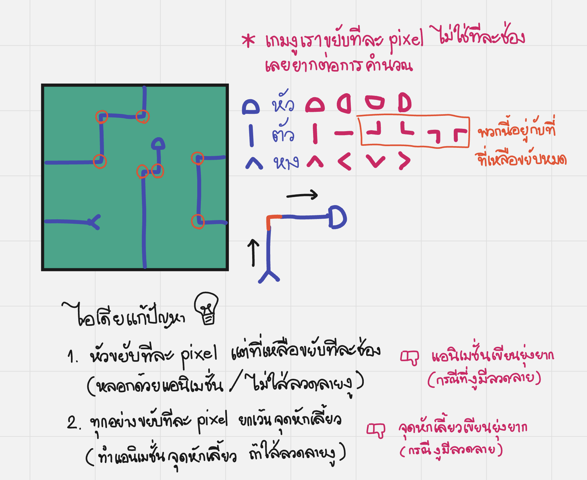
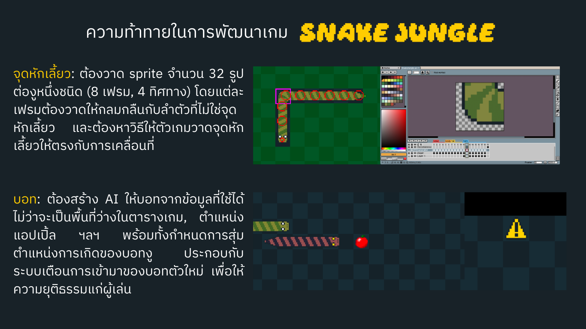
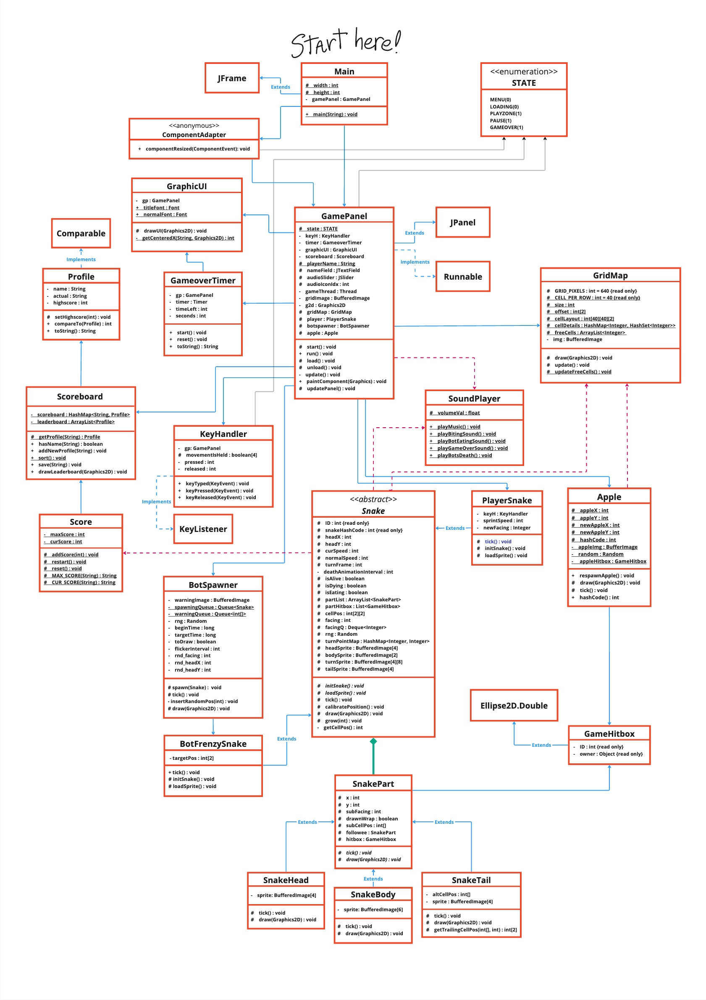

Snake Jungle
===

> Classic snake game with bots written in pure Java with no external library.

Final scoreboard from university event
---

| Name | Score |
| ---- | :---: |
| NW|219|
| pikybooboo7|150|
| Kiwi|145|
| BOM|135|
| pikybooboo6|107|
| pikybooboo8|107|
| Jub|103|
| ARM|88|
| pikybooboo4|85|
| pikybooboo5|61|
| batman|41|
| mao|40|
| pikybooboo|39|
| pikybooboo9|38|
| toh|35|
| pikybooboo2|33|
| dino|32|
| noey|31|
| pns|31|
| nm|29|
| mind|28|
| mamindyahoo|28|
| mamindyahoo4|28|
| nutch|26|
| pikybooboo3|24|
| Pimmkung|22|
| ccc|20|
| nt|20|
| bingchilling|19|
| nite|18|
| Pimkung|17|
| wawawa|16|
| ken|16|
| gggg|16|
| xijinping|15|
| WIN|15|
| ya|15|
| mamindyahoo3|14|
| cola|13|
| belle|13|
| rebon|13|
| jang|12|
| coolkidzzzz|12|
| haha|11|
| pinkeiei|11|
| Jay|9|
| polo|9|
| mor|8|
| Mesa|8|
| grace|8|
| pololo|8|
| pin|8|
| aaa|7|
| mine|7|
| cv|7|
| VroomVroom|7|
| zaaaa|7|
| Kiwislpash|5|
| Josh|3|
| mn|3|
| dada|1|
| minecraft|0|
| xijin|0|

Images about the game (non-english)
---

Class diagram
---

This might be completely incorrect
